# Fid processing — end-to-end flowchart

One view of the whole fid path: the calibration that goes in, the per-observation
reduction, the measured chain applied to each centroid sample, the predicted chain, and
the fit in `asp_solve` that compares them. The narrative and the citations are on the
ska-wiki pages *Fid light corrections* and *Predicted fid positions*; this is the picture
beside them, and `fid-replication.md` is how the Python in this directory maps onto it.

The Mermaid block below is the editable original and the SVG is the render. To redraw
after an edit:

```
npx --yes @mermaid-js/mermaid-cli \
  -i <(awk '/^```mermaid/,/^```$/' docs/fid-flowchart.md | sed '1d;$d') \
  -o docs/fid-flowchart.svg
```

## 1. Diagram



> Static SVG above renders in any markdown viewer (VSCode built-in preview,
> GitHub web, etc.). The Mermaid source below is the editable origin and
> renders inline on GitHub and in VSCode with a Mermaid preview extension
> (e.g. `bierner.markdown-mermaid`). Regenerate the SVG with:
> `npx --yes @mermaid-js/mermaid-cli -i <(awk '/^\`\`\`mermaid/,/^\`\`\`$/' docs/FID_FLOWCHART.md | sed '1d;$d') -o docs/FID_FLOWCHART.svg`

```mermaid
flowchart LR
    %% =========================
    %% CALDB inputs
    %% =========================
    subgraph CALDB["CALDB (external)"]
        direction TB
        CALFDC[/"CALFDC"/]
        CALAFC[/"CALALIGN<br/>ACISFIDCORR"/]
        CALPFC[/"CALALIGN<br/>PERIFIDCORR"/]
        CALe1[/"CALALIGN ext 1<br/>(instr-matched row)"/]
        CALe2[/"CALALIGN ext 2<br/>(per-fid row)"/]
    end

    %% =========================
    %% Per-observation reduction
    %% =========================
    subgraph PREOBS["Per-observation reduction"]
        direction TB
        SIM[/"SIM data product"/]
        ACISENG[/"ACISENG<br/>c1bat, c1bbt"/]
        AID["aca_id_image<br/>Read_CALALIGN_Write_Fidprops()"]
        CADHT["calc_average_dhtemp()"]
        LFC["asp_get_calib<br/>Load_ACIS_Fidcorr"]
        LFDC["asp_get_calib<br/>Load_FDC"]
        FIDPROPS[/"FIDPROPS<br/>p_lsi, lsi0_stt, stt0_stf, rrc0_fc_x,<br/>ang_y_nom, ang_z_nom,<br/>dht_base, dht_mean, deg_per_cnt,<br/>fid_cte, fid_y_coe, fid_z_coe,<br/>peri_y_grd3/6, peri_z_grd3/6"/]
        ACACAL[/"ACACAL<br/>fd_y_fid[20], fd_z_fid[20]"/]
    end

    %% =========================
    %% Per-sample measured chain
    %% =========================
    subgraph MEAS["Per-sample measured chain"]
        direction TB
        ACAL0[/"ACA L0 telemetry"/]
        OBC[/"OBCENG<br/>oobagrd3, oobagrd6"/]
        ARD["aca_read_data"]
        ADATA[/"ACADATA<br/>(raw images)"/]
        ACC["aca_corr_ccd<br/>(dark / flat / responsivity)"]
        ADATAC[/"ACADATA<br/>(corrected)"/]
        ACALC["aca_calc_centr<br/>(PSF / Gaussian / FM fit)"]
        ACEN1(["ACACENT<br/>cent_i, cent_j, flux, chi"])
        ACO["aca_corr_centr<br/>Model_Distortion_P<br/>(20-coef degree-3 polynomial<br/>in R, C, T_ccd_smoothed)"]
        ACEN2(["ACACENT<br/>+ ang_y, ang_z"])
        AFLT["aca_filter_centr<br/>Savitzky-Golay order 4,<br/>40 s window, sigma-clip"]
        ACEN3(["ACACENT<br/>+ ang_y_sm, ang_z_sm"])
        AFID["aca_corr_fid<br/>thermal + periscope (in place)"]
        ACEN4(["ACACENT<br/>ang_y_sm, ang_z_sm (final)"])
    end

    %% =========================
    %% Predicted chain (inside asp_solve, per fit step)
    %% =========================
    subgraph PRED["Predicted chain (per fit step)"]
        direction TB
        PSTF(["p_stf = p_lsi + lsi0_stt + stt0_stf"])
        PFC(["p_fc = Rot_X(theta_X) . p_stf + (0, dy, dz)"])
        DFC(["d_fc = -unit(p_fc - (rrc0_fc_x, 0, 0))"])
        DACAP(["d_aca_pred = M . d_fc<br/>M = acaN2aca . fc2acaN . fts_misalign"])
    end

    %% =========================
    %% asp_solve fit
    %% =========================
    subgraph SOLVE["asp_solve fit"]
        direction TB
        POLINT["polint to KALMAN time<br/>(default order 2)"]
        DACAM(["d_aca_meas =<br/>(1, tan(ang_y_sm), tan(ang_z_sm))"])
        CHI2["chi-square fit over fids<br/>LM mrqmin (default)<br/>or analytic 3x3 solve"]
        FILL["interpolate fitted (dy, dz, dtheta)<br/>to non-fit KALMAN rows"]
        KALMAN[/"KALMAN<br/>ra, dec, roll, q_att, time"/]
        ASPSOL[/"ASPSOL<br/>dy, dz, dtheta (+errors)<br/>ra, dec, roll, q_att (from KALMAN)"/]
    end

    %% =========================
    %% Edges: CALDB + per-observation -> FIDPROPS, ACACAL
    %% =========================
    CALe2 -- "fid_pos_lsi, fid_y_corr[5], fid_z_corr[5],<br/>fid_y_lim[2], fid_z_lim[2]" --> AID
    CALe1 -- "rrc0_fc_x, lsi0_stt,<br/>acaN2aca, fc2acaN, fts_misalign" --> AID
    SIM -- "stt0_stf (quality-bit gated)" --> AID
    AID --> FIDPROPS

    CALAFC -- "fid_y_ang_nom[6], fid_z_ang_nom[6],<br/>dh_temp_base, deg_per_count,<br/>fid_CTE, fid_y_center_nom, fid_z_center_nom" --> LFC
    CALPFC -- "peri_y_oobagrd3/6,<br/>peri_z_oobagrd3/6" --> LFC
    LFC --> FIDPROPS

    ACISENG --> CADHT
    CADHT -- "dht_mean (per-obs scalar)" --> FIDPROPS

    CALFDC -- "fd_y_fid[20], fd_z_fid[20]" --> LFDC
    LFDC --> ACACAL

    %% =========================
    %% Edges: measured chain
    %% =========================
    ACAL0 --> ARD
    ARD --> ADATA
    ADATA --> ACC
    ACC --> ADATAC
    ADATAC --> ACALC
    ACALC --> ACEN1
    ACEN1 --> ACO
    ACACAL -. "fd_y_fid, fd_z_fid<br/>(distortion polynomial)" .-> ACO
    ADATAC -. "CCD temperature<br/>(SG pre-smoothed)" .-> ACO
    ACO --> ACEN2
    ACEN2 --> AFLT
    AFLT --> ACEN3
    ACEN3 --> AFID
    OBC -. "Hanning-smoothed (windowlen=152);<br/>raw means saved" .-> AFID
    FIDPROPS -. "ang_*_nom, dht_base, dht_mean,<br/>deg_per_cnt, fid_cte,<br/>fid_*_coe, peri_*_grd3/6" .-> AFID
    AFID --> ACEN4

    %% =========================
    %% Edges: predicted chain
    %% =========================
    FIDPROPS -- "p_lsi (per fid),<br/>lsi0_stt, stt0_stf, rrc0_fc_x" --> PSTF
    PSTF --> PFC
    PFC --> DFC
    DFC --> DACAP
    CALe1 -. "alignment matrices<br/>(via ACACAL)" .-> DACAP

    %% =========================
    %% Edges: asp_solve fit
    %% =========================
    ACEN4 --> POLINT
    POLINT --> DACAM
    DACAM --> CHI2
    DACAP --> CHI2
    CHI2 --> FILL
    FILL --> ASPSOL
    KALMAN --> ASPSOL

    %% =========================
    %% Styling
    %% =========================
    classDef caldb fill:#fff7e6,stroke:#d48806,stroke-dasharray:5 3,color:#000
    classDef tool fill:#e6f7ff,stroke:#1890ff,color:#000
    classDef data fill:#f6ffed,stroke:#52c41a,color:#000
    classDef file fill:#fff0f6,stroke:#c41d7f,color:#000

    class CALFDC,CALAFC,CALPFC,CALe1,CALe2 caldb
    class AID,LFC,LFDC,CADHT,ARD,ACC,ACALC,ACO,AFLT,AFID,POLINT,CHI2,FILL tool
    class ACEN1,ACEN2,ACEN3,ACEN4,PSTF,PFC,DFC,DACAP,DACAM data
    class FIDPROPS,ACACAL,SIM,ACISENG,ACAL0,ADATA,ADATAC,OBC,KALMAN,ASPSOL file
```



## 2. Legend

| Shape | Color | Meaning |
|---|---|---|
| Parallelogram, dashed border (yellow) | CALDB external input | An extension or column read from a CalDB product. The repo does not write these. |
| Parallelogram (pink) | Per-observation file or telemetry stream | Pipeline-intermediate FITS file (FIDPROPS, ACACAL, ACACENT-as-source) or L0 telemetry (ACAL0, ACISENG, OBCENG) or downstream product (KALMAN, ASPSOL). |
| Rectangle (blue) | Tool / function | A pipeline executable or a named function inside one. |
| Rounded (green) | Intermediate data | A vector / row / scalar produced inside the chain, not a persisted file (e.g. `p_stf`, `d_aca_pred`, ACACENT row state at a given stage). |
| Solid arrow `-->` | Main pipeline data flow | Step *N* writes, step *N+1* reads. |
| Dotted arrow `-.->` | Cross-cutting input | Constants/coefficients/streams pulled in alongside the main flow (e.g. ACACAL coefficients into `aca_corr_centr`, OBCENG into `aca_corr_fid`). |

## 3. What the diagram leaves out

- The fid identification inside `aca_id_image` that decides which slot carries which fid.
  It is a precondition here.
- The sigma-rejection status bits set by `aca_filter_centr`: they mark samples, they do
  not change the data path.
- The per-interval versus per-observation-interval distinction in the solution products,
  and `asp_combine`.
- The guide star half of `aca_corr_centr`, which uses the star variants of the same
  distortion polynomial and feeds the Kalman filter rather than the fid fit.
