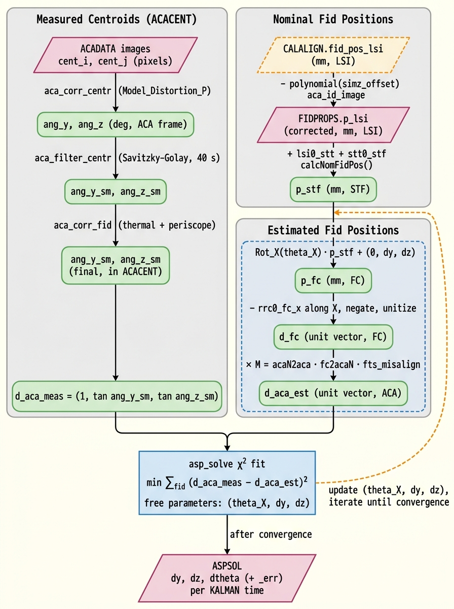
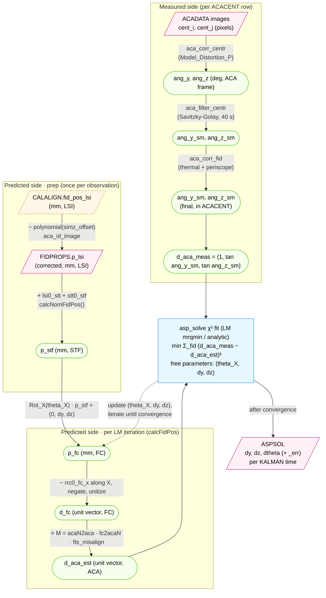

# Predicted fid chain and `asp_solve`

This note bridges the measured-side fid documentation
([FID_LIGHT_PROCESSING.md](FID_LIGHT_PROCESSING.md),
[FID_CORRECTION_STAGES.md](FID_CORRECTION_STAGES.md)) and the per-interval
[ASPSOL_PRODUCTS.md](ASPSOL_PRODUCTS.md) by documenting the **predicted
(model-side) fid chain** — how each fid's nominal LSI position is propagated
into a predicted ACA-frame direction cosine — and **what `asp_solve`
actually does** with the measured and predicted sides.

Audience: a developer who has read the measured-side docs and wants to
reimplement the fid-driven part of `asp_solve` in `numpy` / `scipy`. Each
algorithm step gives the C citation in the pipeline plus the
scipy/numpy primitive that reproduces it.

---

## 1. The two parallel chains



The doc names the predicted ACA-frame direction cosine `d_aca_est`;
the C code calls the same vector `fid[i].d_aca` (no suffix). The two
sides compared in the chi-square are `d_aca_meas` and `d_aca_est`.

> The PNG above was rendered by Nano Banana
> (`gemini-3-pro-image-preview`) from the prompt at
> [PREDICTED_FID_AND_ASP_SOLVE_decorative_prompt.txt](PREDICTED_FID_AND_ASP_SOLVE_decorative_prompt.txt).
> The Mermaid block below remains the editable origin: if its structure
> changes, update the prompt to match and regenerate the PNG via the
> Gemini CLI nanobanana extension. The Mermaid block also renders inline
> on GitHub and in VSCode with a Mermaid preview extension
> (e.g. `bierner.markdown-mermaid`).



The predicted chain has a once-per-observation prep
(`p_lsi → p_stf` upstream of the fit) and a per-LM-iteration body
(`p_stf → … → d_aca_est` rebuilt by `calcFidPos` each step). The
measured side is built once upstream and read row-by-row.

---

## 2. The predicted chain, step by step

All steps below apply per fid `i` and per time step. Frame conventions:

- **LSI** — Local Science Instrument, mm. Origin at the science-instrument fiducial reference point.
- **STT** — SIM Translation Table, mm.
- **STF** — STF (SIM Focus assembly), mm.
- **FC** — Focal Coordinates (centered on the optical axis), mm.
- **ACA** — ACA boresight unit vector, dimensionless.

### 2.1 Corrected `p_lsi` (built upstream by `aca_id_image`)

`p_lsi[3]` for each fid is read out of FIDPROPS. It is not the raw
CALALIGN `fid_pos_lsi[3]` — `aca_id_image` applies a 4th-order polynomial
correction in the focal-plane Z displacement before writing FIDPROPS;
see §6 below for the full derivation. For the predicted chain
proper, treat `p_lsi` as a given input.

### 2.2 LSI → STT → STF translation

```c
fid[i].p_stf = fid[i].p_lsi + lsi0_stt + stt0_stf;
```
Source: [ACA_Solve.cc:1431-1442](../dstools/asp/asp_solve/ACA_Solve.cc#L1431-L1442) (`calcNomFidPos()`).

`lsi0_stt[3]` and `stt0_stf[3]` are FIDPROPS *keywords* (not columns),
populated by `Read_CALALIGN_Write_Fidprops()` (§6). They are the same
for every fid in an observation.

NumPy:

```python
p_stf = p_lsi + lsi0_stt + stt0_stf   # all 3-vectors in mm
```

### 2.3 STF → FC: roll, then translate

```c
Rot_X.mvmult(fid[i].p_fc, fid[i].p_stf);   // p_fc = Rot_X(theta_X) · p_stf
fid[i].p_fc += stf0_fc;                    // stf0_fc = (0, dy, dz)
```

`(theta_X, dy, dz)` are the **three free parameters of the LM fit**
described in §4 — the same triplet that ends up in ASPSOL. The
identification is direct, not a delta:
`theta_X ≡ ASPSOL.dtheta`, `dy ≡ ASPSOL.dy`, `dz ≡ ASPSOL.dz`
(the fit-side and FITS-side names differ but the values are the same;
see [ACA_Solve.cc:2378](../dstools/asp/asp_solve/ACA_Solve.cc#L2378)
for the assignment). Units: `theta_X` in **degrees**, a rotation
about the optical (X) axis; `dy`, `dz` in **mm**, FC-frame SIM-origin
offsets. The values in §2.3 are the **current LM iterate** — §2.3 is
inside the loop body, not upstream of it. Initial values come from
the `theta_X_start`, `dy_start`, `dz_start` parameters
([asp_solve.par:22-24](../dstools/asp/asp_solve/asp_solve.par#L22-L24),
all default `0`). When `num_fidlights == 1`, `theta_X` is held fixed
because it is degenerate (see §4.1).

Construction of `Rot_X` and its derivative `dRot_X/dtheta` at
[ACA_Solve.cc:148-160](../dstools/asp/asp_solve/ACA_Solve.cc#L148-L160).
Application at
[ACA_Solve.cc:184-185](../dstools/asp/asp_solve/ACA_Solve.cc#L184-L185).

NumPy:

```python
from scipy.spatial.transform import Rotation
Rot_X = Rotation.from_euler('x', theta_X, degrees=True).as_matrix()
p_fc = Rot_X @ p_stf + np.array([0.0, dy, dz])
```

### 2.4 FC → direction cosine

```c
fid[i].d_fc       = fid[i].p_fc;
fid[i].d_fc[0]   -= rrc0_fc_x;
fid[i].d_fc      *= -1.0;
fid[i].d_fc.unitize();
```
Source: [ACA_Solve.cc:186-189](../dstools/asp/asp_solve/ACA_Solve.cc#L186-L189).

`rrc0_fc_x` is the FC-frame X coordinate of the RRC origin (HRMA
focus), a scalar FIDPROPS keyword. The leading `*= -1.0` is a sign
convention so positive `d_fc[0]` points outward from the focal plane.

NumPy:

```python
v = p_fc - np.array([rrc0_fc_x, 0.0, 0.0])
d_fc = -v / np.linalg.norm(v)
```

### 2.5 FC → ACA via the alignment chain

```c
M.mmult(M_temp, acaN2aca, fc2acaN);     // assembled in setupChiSquared()
M.mmult(M, M_temp, fts_misalign);
...
M.mvmult(fid[i].d_aca, fid[i].d_fc);    // applied per fid
```
Source: assembly at
[ACA_Solve.cc:2018-2022](../dstools/asp/asp_solve/ACA_Solve.cc#L2018-L2022),
application at
[ACA_Solve.cc:194](../dstools/asp/asp_solve/ACA_Solve.cc#L194).

`M = acaN2aca · fc2acaN · fts_misalign` chains three 3×3 alignment
matrices, all loaded together from a single row of **CALALIGN ext 1**
(`EXTNAME="CALALIGN"`) by `Load_ACA_Align()` at
[load_aca_align.c:86-99](../dstools/asp/asp_get_calib/load_aca_align.c#L86-L99)
and copied into the `ACA_Solve` `dvm3_Matrix` members at
[ACA_Solve.cc:1403-1405](../dstools/asp/asp_solve/ACA_Solve.cc#L1403-L1405).
The matched row is the one whose `instr_id` matches the instrument
inferred from `SIM_Z`; element-for-element copy, no transpose.

| In-code name | Meaning | CALALIGN ext 1 column |
|---|---|---|
| `fts_misalign` | FTS-frame fix-up inside FC | `FTS_MISALIGN` |
| `fc2acaN` | FC → ACA-nominal rotation | `ACA_SC_ALIGN` (named "ACA to S/C nominal alignment" in [calalign.h:34](../dstools/asp/aspect_lib/calalign.h#L34); for Chandra the S/C-nominal and FC frames coincide, so the same matrix serves as FC→ACA-nominal in code) |
| `acaN2aca` | ACA-nominal → ACA-actual misalignment | `ACA_MISALIGN` |

The same ext 1 row also supplies `lsi0_stt` (§2.2) and `rrc0_fc_x` (§2.4).
Per-fid columns (`fid_pos_lsi`, `fid_y_corr`, …) live in ext 2
(`EXTNAME="CALALIGN1"`); see §6.

NumPy:

```python
M = acaN2aca @ fc2acaN @ fts_misalign
d_aca_est = M @ d_fc
```

### 2.6 Predicted observable: direction cosines, not angles

The fit operates on direction cosines, *not* on `(ang_y, ang_z)`. The
measured side converts ACACENT angles back to a unit vector for the
comparison; the predicted side stays in `d_aca_est` directly. See §3
for the conversion of measured `ang_*_sm` to a direction cosine.

If you want the predicted angles for reporting:

```python
ang_y = np.degrees(np.arctan(d_aca_est[1] / d_aca_est[0]))   # tan-form, matches
ang_z = np.degrees(np.arctan(d_aca_est[2] / d_aca_est[0]))   # the measurement
```

---

## 3. Measured-side preparation inside `asp_solve`

The smoothed angles arrive from `aca_corr_fid` as ACACENT columns
`ang_y_sm`, `ang_z_sm` (deg, ACA frame). For each fit step,
`asp_solve` prepares them in two stages.

### 3.1 Time interpolation of measured angles

For each KALMAN time slice, polynomial-interpolate measured
`ang_y_sm`, `ang_z_sm` per fid to that time. Functions:
`updateNearestPoints()` and `convertMeasurements()` (call sites in
ACA_Solve.cc; the inner numerics are Numerical Recipes `polint`).

NumPy: for the default `polint_order = 2`, fit a quadratic over the
3-point local window and evaluate:

```python
coeffs = np.polyfit(t_window, ang_y_window, 2)
ang_y_at_t = np.polyval(coeffs, t)
```

(Strict-Lagrange form is `scipy.interpolate.lagrange`; `np.polyfit` is
faster and numerically equivalent for this small window.)

### 3.2 Measured direction cosine

The C tool builds `d_aca_meas` in two steps:

1. **Build** ([ACA_Solve.cc:1928](../dstools/asp/asp_solve/ACA_Solve.cc#L1928),
   `convertMeasurements`) — tangent-projection form, `[0]` fixed at 1:

   ```python
   d_aca_meas = np.array([1.0,
                          np.tan(np.radians(ang_y_sm)),
                          np.tan(np.radians(ang_z_sm))])
   ```

2. **Unitize** ([ACA_Solve.cc:2269](../dstools/asp/asp_solve/ACA_Solve.cc#L2269),
   `minimizeChiSquared`, just before `mrqmin`) — row-by-row L2
   normalization so `[0]` is no longer identically 1:

   ```python
   d_aca_meas /= np.linalg.norm(d_aca_meas, axis=-1, keepdims=True)
   ```

The chi-square then compares two unit vectors. Only the `[1]` and
`[2]` components are used (the residuals are over `(y, z)`); the
`[0]` component is close to 1 but not identically 1 after unitize.

---

## 4. The chi-square fit

For each KALMAN time slice (controlled by parameter `n_step`), fit
the three free parameters `(theta_X, dy, dz)` over all
`num_fidlights` fids by minimizing

```
chi^2 = Σ_fid [ (d_aca_meas[1] − d_aca_est[1])^2
              + (d_aca_meas[2] − d_aca_est[2])^2 ]
```

with `d_aca_est` rebuilt via §2 from current `(theta_X, dy, dz)`.

### 4.1 Levenberg-Marquardt path (default)

C: Numerical Recipes `mrqmin`, called with the analytic Jacobian
provided by `calcFidPos()` at
[ACA_Solve.cc:140-234](../dstools/asp/asp_solve/ACA_Solve.cc#L140-L234).

Convergence: `(prev_chisq − convergence) < chisq` with
`convergence = 0.001` and `max_iterations = 100`. Defaults from
`asp_solve.par`.

Single-fid case: `theta_X` is degenerate (only roll-rotated radial
distances enter the chi-square), so it is held fixed at the seed
value and assigned `EMPIRICAL_THETA_ERR = 20"` after the fit
([ACA_Solve.cc:2003-2009](../dstools/asp/asp_solve/ACA_Solve.cc#L2003-L2009),
[ACA_Solve.cc:2210-2213](../dstools/asp/asp_solve/ACA_Solve.cc#L2210-L2213)).

scipy:

```python
from scipy.optimize import least_squares

def residuals(params, p_lsi, lsi0_stt, stt0_stf, M, rrc0_fc_x, d_aca_meas):
    theta_X, dy, dz = params
    Rx = rotation_x(theta_X)              # 3x3
    p_stf = p_lsi + lsi0_stt + stt0_stf   # (n_fid, 3)
    p_fc  = p_stf @ Rx.T + np.array([0.0, dy, dz])
    v     = p_fc - np.array([rrc0_fc_x, 0.0, 0.0])
    d_fc  = -v / np.linalg.norm(v, axis=1, keepdims=True)
    d_aca_est = d_fc @ M.T
    # Match C minimizeChiSquared (ACA_Solve.cc:2269) — d_aca_meas comes
    # in as (1, tan_y, tan_z); unitize before chi-square.
    d_aca_meas_unit = d_aca_meas / np.linalg.norm(
        d_aca_meas, axis=1, keepdims=True
    )
    return (d_aca_meas_unit[:, 1:] - d_aca_est[:, 1:]).ravel()

result = least_squares(
    residuals, x0=[theta_X0, dy0, dz0], method='lm',
    xtol=0.001,   # matches `convergence`
    max_nfev=100, # matches `max_iterations`
    args=(p_lsi, lsi0_stt, stt0_stf, M, rrc0_fc_x, d_aca_meas),
)

# Recover covariance from the Jacobian at the solution.
JtJ_inv = np.linalg.inv(result.jac.T @ result.jac)
sigmas  = np.sqrt(np.diag(JtJ_inv))
```

`scipy.optimize.curve_fit` is an alternative that returns `pcov`
directly but is harder to fit to the multi-output residual shape here.

### 4.2 Analytic alternative

When `max_iterations <= 0`, `asp_solve` solves the 3×3 normal equations
directly — `minimizeChiSquared_analytic()` at
[ACA_Solve.cc:2087-2235](../dstools/asp/asp_solve/ACA_Solve.cc#L2087-L2235).
The chi-square is linearized in `dtheta` (small-angle), giving a
3×3 system `M_i · [dy, dz, dtheta] = X_i` summed over fids.

NumPy:

```python
np.linalg.solve(Mi, Xi)        # parameters
np.linalg.inv(Mi)              # full covariance
```

The 3×3 is well-conditioned for `num_fidlights ≥ 2`. For
`num_fidlights == 1`, the code drops to the leading 2×2 and inserts
the same `EMPIRICAL_THETA_ERR` fallback as the LM path
([ACA_Solve.cc:2200-2213](../dstools/asp/asp_solve/ACA_Solve.cc#L2200-L2213)).

### 4.3 Filling in between fitted steps

ASPSOL has one row per KALMAN time (already populated from the
attitude side). The fitted `(dy, dz, dtheta)` are computed only at
every `n_step`-th row and interpolated polynomially to fill the
in-between rows. Function: `calcSolutionInterpolation()` at
[ACA_Solve.cc:2410](../dstools/asp/asp_solve/ACA_Solve.cc#L2410).

NumPy: same `np.polyfit` + `np.polyval` recipe as §3.1.

---

## 5. What ends up in `_asol1.fits`

Per-time columns and where they come from:

| Column | Source | Where written |
|---|---|---|
| `time` | KALMAN | `copyKalmanData()` [ACA_Solve.cc:1578](../dstools/asp/asp_solve/ACA_Solve.cc#L1578) |
| `ra`, `dec`, `roll` | KALMAN `q_att_est`, transformed to MNC | [ACA_Solve.cc:1560-1568](../dstools/asp/asp_solve/ACA_Solve.cc#L1560-L1568) |
| `ra_err`, `dec_err`, `roll_err` | KALMAN covariance, projected | [ACA_Solve.cc:1571-1575](../dstools/asp/asp_solve/ACA_Solve.cc#L1571-L1575) |
| `q_att[4]` | KALMAN, frame-converted | [ACA_Solve.cc:1567-1568](../dstools/asp/asp_solve/ACA_Solve.cc#L1567-L1568) |
| `roll_bias`, `pitch_bias`, `yaw_bias` (+ errors) | KALMAN | [ACA_Solve.cc:1579-1584](../dstools/asp/asp_solve/ACA_Solve.cc#L1579-L1584) |
| `dy`, `dz`, `dtheta` (+ errors) | fid fit | `mapFitResults()` [ACA_Solve.cc:2374-2387](../dstools/asp/asp_solve/ACA_Solve.cc#L2374-L2387) |

Note that **`ra`, `dec`, `roll` are seeded from KALMAN, not from the
fid fit.** The fit produces only the SIM-frame offsets `(dy, dz, dtheta)`.

Header keywords:

| Keyword | Source |
|---|---|
| `SIM_X`, `SIM_Y`, `SIM_Z` | `fidprops.stt0_stf[0/1/2]` ([ACA_Solve.cc:1609-1614](../dstools/asp/asp_solve/ACA_Solve.cc#L1609-L1614)) |
| `pitchamp`, `yawamp` | running min/max from `att_stat()` ([ACA_Solve.cc:1600-1601](../dstools/asp/asp_solve/ACA_Solve.cc#L1600-L1601)) |
| `TIMEDEL`, `TIMEPIXR` | KALMAN header copy ([ACA_Solve.cc:1505-1524](../dstools/asp/asp_solve/ACA_Solve.cc#L1505-L1524)) |
| `acsys1` = `"ASPSOL=MNC"`, `asp_type` = `"KALMAN"`, `bias_type` = `"KALMAN"` | hard-coded ([ACA_Solve.cc:1602-1604](../dstools/asp/asp_solve/ACA_Solve.cc#L1602-L1604)) |

Cross-reference [ASPSOL_PRODUCTS.md](ASPSOL_PRODUCTS.md) for the CAI vs
OBI distinction and the `asp_combine` post-processing.

---

## 6. FIDPROPS population: `Read_CALALIGN_Write_Fidprops()`

The keystone function that links calibration to the predicted chain.
Defined in
[Aca_Id_Image.cc:1871](../dstools/asp/aca_id_image/Aca_Id_Image.cc#L1871),
called as the last step (step 13) of the driver at
[aca_id_image.cc:261](../dstools/asp/aca_id_image/aca_id_image.cc#L261).
This single function populates **every** FIDPROPS keyword and column
that `asp_solve` consumes from the predicted side. The mapping:

| FIDPROPS field | Source | Citation |
|---|---|---|
| `rrc0_fc_x` (kw) | CALALIGN ext 1, instr-matched row | [Aca_Id_Image.cc:1994](../dstools/asp/aca_id_image/Aca_Id_Image.cc#L1994) |
| `lsi0_stt[3]` (kw) | CALALIGN ext 1, instr-matched row | [Aca_Id_Image.cc:1995-1996](../dstools/asp/aca_id_image/Aca_Id_Image.cc#L1995-L1996) |
| `stt0_stf[3]` (kw) | SIM data product `sim_x/y/z` | [Aca_Id_Image.cc:2104-2106](../dstools/asp/aca_id_image/Aca_Id_Image.cc#L2104-L2106) |
| `p_lsi[3]` (col) | CALALIGN ext 2 `fid_pos_lsi[3]`, polynomial-corrected | [Aca_Id_Image.cc:2350-2351](../dstools/asp/aca_id_image/Aca_Id_Image.cc#L2350-L2351) |

### 6.1 Instrument matching

Row selection from CALALIGN extension 1 is by `strncmp(obs_si,
calalign.instr_id, 6) == 0`
([Aca_Id_Image.cc:1989](../dstools/asp/aca_id_image/Aca_Id_Image.cc#L1989)).
`obs_si` is the OCAT science-instrument string ("ACIS-I", "ACIS-S",
"HRC-I", "HRC-S"), parsed from the OCAT input file at
[Aca_Id_Image.cc:408](../dstools/asp/aca_id_image/Aca_Id_Image.cc#L408).

**Worth flagging for a Python port.** A code comment at
[Aca_Id_Image.cc:1939-1940](../dstools/asp/aca_id_image/Aca_Id_Image.cc#L1939-L1940)
describes the intended logic as choosing among four DP variables —
`as_lsi0_stt`, `ai_lsi0_stt`, `hs_lsi0_stt`, `hi_lsi0_stt` — based on
`obs_si`. The implementation does *not* do this; it picks a single
`instr_id`-matched row from one column. Anyone porting from the design
comment will look for four code paths and not find them.

### 6.2 SIM file open and quality gate

`stt0_stf` is the only FIDPROPS keyword sourced from outside CALALIGN.
It comes from the **SIM data product** — a FITS file whose binary-table
extension is named `AXAF_SIMCOOR` and whose columns are `TIME`,
`TLM_FMT`, `SEAIDENT`, `SIM_X`, `SIM_Y`, `SIM_Z` (all in mm),
`SIM_X_MOVED`, `SIM_Z_MOVED`, and parallel `QUALITY` bits. Struct at
[sim.h:23-54](../dstools/asp/aspect_lib/sim.h#L23-L54); column layout
written by `sim_compute_stf_pos` at
[sim_compute_stf_pos.h:93-142](../nonsi/sim_compute_stf_pos/sim_compute_stf_pos.h#L93-L142).
The product is the level-0.5 output of the `sim_lev05` pipeline
([sim_lev05.ped:159](../pipelines/nonsi/sim/sim_lev05.ped#L159)),
written with the template `sim<root>_coor0a.fits` — e.g.
`simf071646469N001_coor0a.fits` for a single segment, or a
`@<root>_sim.lis` stack list spanning an OBI.

`aca_id_image` receives the path through the `simcoorfile` parameter
([aca_id_image.par:9](../dstools/asp/aca_id_image/aca_id_image.par#L9),
read into `inpars->sim_file` at
[aca_id_image_inparams.cc:112](../dstools/asp/aca_id_image/aca_id_image_inparams.cc#L112)).
Inside `Read_CALALIGN_Write_Fidprops()`, the file is opened and rows
are streamed at
[Aca_Id_Image.cc:2032-2041](../dstools/asp/aca_id_image/Aca_Id_Image.cc#L2032-L2041),
walked over `tstart..tstop` at
[Aca_Id_Image.cc:2063-2109](../dstools/asp/aca_id_image/Aca_Id_Image.cc#L2063-L2109),
and the first row whose `sim_x_q`, `sim_y_q`, `sim_z_q` all have bit 0
clear is the one that wins
([Aca_Id_Image.cc:2098-2100](../dstools/asp/aca_id_image/Aca_Id_Image.cc#L2098-L2100)).
That row's `(sim_x, sim_y, sim_z)` is copied directly into
`fidprops.stt0_stf[0/1/2]`
([Aca_Id_Image.cc:2104-2106](../dstools/asp/aca_id_image/Aca_Id_Image.cc#L2104-L2106));
bad quality on any of the three is fatal for the whole tool.

### 6.3 The LSI polynomial correction

For each fid identified in this observation, `p_lsi` is **not** a
direct copy of the CALALIGN `fid_pos_lsi`. The CALALIGN extension 2
columns `fid_y_corr[5]`, `fid_z_corr[5]`, `fid_y_lim[2]`, `fid_z_lim[2]`
([calalign.h:45-48](../dstools/asp/aspect_lib/calalign.h#L45-L48))
parameterize a 4th-order polynomial correction in the focal-plane Z
displacement:

```c
simz_offset = fidprops.lsi0_stt[2] + fidprops.stt0_stf[2];   // mm

dy = 0; dz = 0;
for (ii = 0; ii < 5; ii++) {
   offset_power = pow(simz_offset, ii);
   dy += calalign_dat[i_row].fid_y_corr[ii] * offset_power;
   dz += calalign_dat[i_row].fid_z_corr[ii] * offset_power;
}
```
Source:
[Aca_Id_Image.cc:2265, 2272-2283](../dstools/asp/aca_id_image/Aca_Id_Image.cc#L2265-L2283).

The polynomial **input variable** is `simz_offset`, the total
displacement of the focal plane along the optical axis (mm). This is
not a temperature — Friday's working hypothesis that it might be CCD
temperature was wrong. It is purely geometric: `lsi0_stt[2]` is the
science-instrument's Z offset along the optical axis from the SIM
nominal, and `stt0_stf[2]` is the in-flight SIM Z position; their sum
is the focus-plane shift the fid LEDs experience.

The corrections are then **clipped** to per-fid limits before being
applied:

```c
dy = clip(dy, fid_y_lim[0], fid_y_lim[1]);
dz = clip(dz, fid_z_lim[0], fid_z_lim[1]);
```
Source:
[Aca_Id_Image.cc:2292-2320](../dstools/asp/aca_id_image/Aca_Id_Image.cc#L2292-L2320).
A `limits_hit` flag is set when clipping engages.

The clipped corrections are **subtracted** from `fid_pos_lsi[1]` and
`fid_pos_lsi[2]`; the X component (along the optical axis) is left
unchanged:

```c
calalign_dat[i_row].fid_pos_lsi[1] -= dy;
calalign_dat[i_row].fid_pos_lsi[2] -= dz;
```
Source:
[Aca_Id_Image.cc:2334-2336](../dstools/asp/aca_id_image/Aca_Id_Image.cc#L2334-L2336).

The corrected vector is then copied verbatim to `fidprops.p_lsi[]` at
[Aca_Id_Image.cc:2350-2351](../dstools/asp/aca_id_image/Aca_Id_Image.cc#L2350-L2351)
and written to the FIDPROPS row at
[Aca_Id_Image.cc:2416](../dstools/asp/aca_id_image/Aca_Id_Image.cc#L2416).

NumPy:

```python
simz_offset = lsi0_stt[2] + stt0_stf[2]   # scalar, mm

# numpy.polynomial.polynomial.polyval expects ascending-order coefficients
# [c0, c1, c2, c3, c4] — matching the C loop. DO NOT use numpy.polyval,
# which expects them reversed.
from numpy.polynomial.polynomial import polyval
dy = polyval(simz_offset, fid_y_corr)
dz = polyval(simz_offset, fid_z_corr)

dy = np.clip(dy, fid_y_lim[0], fid_y_lim[1])
dz = np.clip(dz, fid_z_lim[0], fid_z_lim[1])

p_lsi    = fid_pos_lsi.copy()   # X component preserved
p_lsi[1] -= dy
p_lsi[2] -= dz
```

### 6.4 Per-fid iteration

`Read_CALALIGN_Write_Fidprops()` iterates over every OCAT fid (rows of
type `OCAT_FID_TYPE` in the OCAT table), matches each by FID id to a
row of CALALIGN extension 2 (`calalign_dat[]`), applies the §6.3
recipe, and writes one FIDPROPS row per matched fid. Outer loop at
[Aca_Id_Image.cc:2220-2419](../dstools/asp/aca_id_image/Aca_Id_Image.cc#L2220-L2419);
FIDPROPS row write at
[Aca_Id_Image.cc:2416](../dstools/asp/aca_id_image/Aca_Id_Image.cc#L2416).

### 6.5 What this function does *not* populate

These FIDPROPS fields are written by other tools, not by
`Read_CALALIGN_Write_Fidprops()`:

- `ang_y_nom`, `ang_z_nom` and the thermal/periscope header keywords
  (`dht_base`, `dht_mean`, `deg_per_cnt`, `fid_cte`, `fid_y_coe`,
  `fid_z_coe`, `peri_{y,z}_grd{3,6}`) — written later by
  `asp_get_calib`'s `Load_ACIS_Fidcorr` from CALALIGN's ACISFIDCORR
  and PERIFIDCORR extensions. See
  [FID_LIGHT_PROCESSING.md §4](FID_LIGHT_PROCESSING.md#4-fidprops-construction)
  and
  [FID_CORRECTION_STAGES.md §2](FID_CORRECTION_STAGES.md#2-calalign-column--fidprops-header-mapping).
- `id_string`, `id_num`, `id_status`, magnitude fields — set in the
  same `Read_CALALIGN_Write_Fidprops()` row write at
  [Aca_Id_Image.cc:2353-2413](../dstools/asp/aca_id_image/Aca_Id_Image.cc#L2353-L2413)
  but not relevant to the predicted-chain population.

> **Note for macOS reviewers.** `Aca_Id_Image.cc` and its lowercase
> sibling `aca_id_image.cc` (a 295-line driver with the same lowercase
> filename) coexist in the same directory and **collide on
> case-insensitive filesystems**. If you check this repo out on
> default macOS APFS, one of the two files will silently disappear.
> See [MACOS_DEV_SETUP.md](MACOS_DEV_SETUP.md) for the case-sensitive
> sparse-bundle setup the review work is conducted on.

---

## 7. Source-file index

| Concern | File |
|---|---|
| Fid identification + FIDPROPS write (`Read_CALALIGN_Write_Fidprops`) | [dstools/asp/aca_id_image/Aca_Id_Image.cc](../dstools/asp/aca_id_image/Aca_Id_Image.cc), [aca_id_image.cc](../dstools/asp/aca_id_image/aca_id_image.cc), [Aca_Id_Image.hh](../dstools/asp/aca_id_image/Aca_Id_Image.hh) |
| Predicted chain (`calcNomFidPos`, `calcFidPos`, `setupChiSquared`) | [dstools/asp/asp_solve/ACA_Solve.cc](../dstools/asp/asp_solve/ACA_Solve.cc), [ACA_Solve.hh](../dstools/asp/asp_solve/ACA_Solve.hh) |
| LM fit and analytic alternative (`minimizeChiSquared`, `minimizeChiSquared_analytic`) | [dstools/asp/asp_solve/ACA_Solve.cc](../dstools/asp/asp_solve/ACA_Solve.cc) |
| ASPSOL row population from KALMAN (`copyKalmanData`) | [dstools/asp/asp_solve/ACA_Solve.cc](../dstools/asp/asp_solve/ACA_Solve.cc) |
| Solver parameters | [dstools/asp/asp_solve/asp_solve.par](../dstools/asp/asp_solve/asp_solve.par) |
| CALALIGN struct | [dstools/asp/aspect_lib/calalign.h](../dstools/asp/aspect_lib/calalign.h), [calalign.c](../dstools/asp/aspect_lib/calalign.c) |
| FIDPROPS struct | [dstools/asp/aspect_lib/fidprops.h](../dstools/asp/aspect_lib/fidprops.h), [fidprops.c](../dstools/asp/aspect_lib/fidprops.c) |
| ACACAL alignment-matrix loading | [dstools/asp/asp_get_calib/load_aca_align.c](../dstools/asp/asp_get_calib/load_aca_align.c) |
